  
  
  
  
  
  <!-- See https://stackoverflow.com/questions/63376500/how-do-i-add-my-stack-overflow-reputation-as-a-live-badge-on-github -->
  
  
  
  
  
  
  <a href="https://keybase.io/{{ user.login }}"><a>
   
  
  
   
  <!-- this is dead
  
  -->
  <!-- use this if user is on the leaderboard; currently I am not
    https://stardev.io/developers/jayvdb
  -->

Other analytics that show that the following is accurate:

- https://ossinsight.io/analyze/jayvdb
- https://codetrace.com/users/jayvdb (Note to self, it is static until user requests a new analysis)

---------------------------------------------------------------------------------------------------------------------------------------------------------------------------------

### 📈 Stats

### 📚 Most used languages

### 📚 Recent languages

### Notable contributions

### 🏅 Achievements

### Followup

### Habits

</a>

### Code snippet

### Stack Overflow

---------------------------------------------------------------------------------------------------------------------------------------------------------------------------------

<h6 align="right"><em>
    Generated daily with <a href="https://github.com/lowlighter/metrics">lowlighter/metrics v{{ VERSION }}</a> 🛠️ <!-- VERSION => MAJOR.minor.patch -->
</em></h6>
